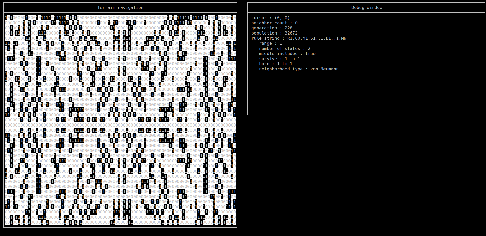

# nCA
ncurses Cellular Automata

# Usage
`./nCA -r <LtL_rulestring>`

`<LtL_rulestring>` is a rulestring using the [Larger than Life notation](http://www.conwaylife.com/wiki/Larger_than_Life).

## Examples  

### Conway's Game of Life

`./nCA -r "R1,C0,M0,S2..3,B3..3,NM"`

## Gnarl

`./nCA -r "R1,C0,M1,S1..1,B1..1,NN"`

